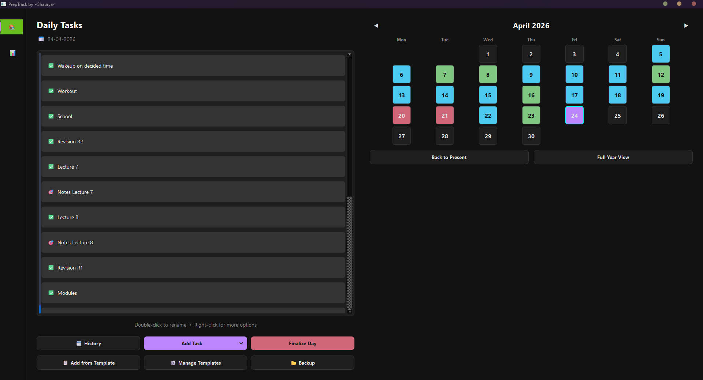
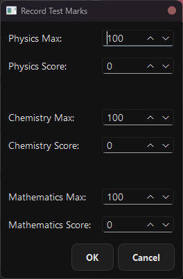
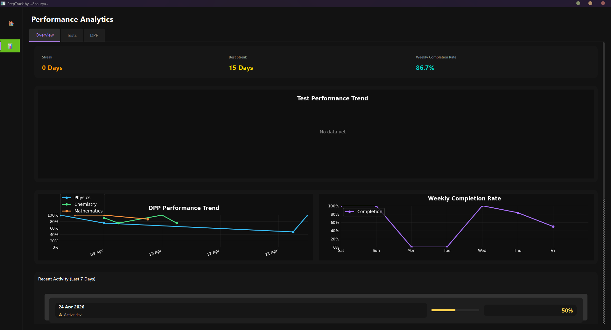
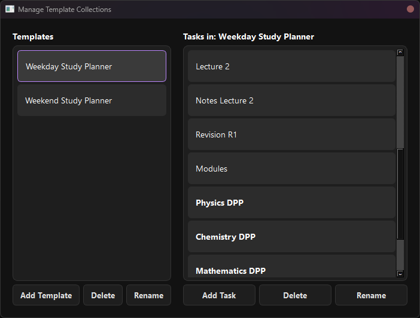
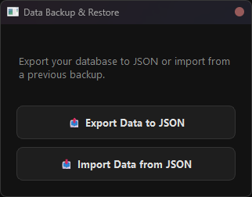

# PrepTrack (v1.2.2) 🎯

### A High-Performance Productivity Tool for Students

**By ~Shaurya~**



PrepTrack is a specialized desktop application built for students and aspirants (JEE, NEET, etc.) to track their daily goals, practice problems, and mock test performance with precision. Unlike generic todo apps, PrepTrack integrates subject-wise metrics and automated scheduling to help you stay ahead of your preparation.

---

## ✨ Key Features

- **🎯 Specialized Task Management**: Organize your day into Regular Tasks, DPPs (Daily Practice Problems), and Mock Tests.
- **📈 Subject-Wise Performance**: Track marks for Physics, Chemistry, and Mathematics separately for tests.
  
- **📊 Dynamic Dashboard**: Visualize your progress with completion rates and performance graphs (built with Matplotlib).
  
- **🗓️ Automated Test Scheduling**: Pre-loaded JEE Main and Advanced test schedules (According to MissionJEET test schedule) to ensure you never miss a milestone.
- **🌙 Late Night Mode**: Study past midnight? PrepTrack maintains your "logical day" until 4 AM, so your streaks remain intact.
- **📋 Template System**: Create "Collections" of recurring tasks (e.g., "Morning Routine" or "Standard Physics Session") and apply them in one click.
  
- **📂 Backup & Portability**: Export your entire progress to JSON and restore it on any machine.
  
- **💎 Modern Dark UI**: A sleek, focused interface designed to reduce eye strain during long study sessions.

---

## 🛠️ Technology Stack

- **Language**: Python 3.10+
- **GUI Framework**: PyQt6
- **Visualization**: Matplotlib
- **Database**: SQLite3 (Local)
- **Storage**: Data is stored persistently in `%LOCALAPPDATA%/PrepTrack`

---

## 🚀 Getting Started

### Installation

1. Download the [latest version](https://github.com/LordsFlix/PrepTrack/releases/latest/download/PrepTrack-Setup-v1.2.2.exe) (e.g., `PrepTrack-Setup-v1.2.2.exe`).
2. Run the installer and follow the on-screen instructions.
3. Once installed, launch **PrepTrack** from your desktop or start menu.

> [NOTE]
> No Python installation is required to run the application, as it is bundled with all necessary dependencies.

---

## 📖 Usage Guide

### 1. Adding Tasks

Click the **"Add Task"** button to choose between:

- **Regular Task**: General todo items.
- **DPP**: Select a subject (PCM) to track practice sessions.
- **Test**: Select a category (JEE Main, Advanced, Full Test) to record exam scores.

### 2. Recording Marks

When you complete a Test or DPP, double-click the task to record your marks. For Tests, PrepTrack provides a subject-wise breakdown (Physics, Chemistry, Maths) and automatically calculates your total score.

### 3. Finalizing the Day

At the end of your day, click **"Finalize Day"**. You can rate your productivity (0-100%). Any pending tasks will be marked as "Incomplete," and your dashboard will update with the day's metrics.

### 4. History & Calendar

Toggle the **"History"** view to look back at past days. The calendar view allows you to see your historical task completion and day ratings.

---

## 📂 Project Structure

```text
todo/
├── assets/             # UI Icons and Images
├── src/                # Source Code
│   ├── ui/             # PyQt6 Window and Widget definitions
│   ├── database.py     # SQLite logic and migrations
│   ├── main.py         # Entry point
│   └── test_schedule.py# Automated test dates
├── requirements.txt    # Python dependencies
└── readme.md           # You are here!
```

---

## 👤 Credits & Support

Created with ❤️ by **Shaurya**.

_Designed for high-performance aspirants who believe in tracking every bit of progress._
